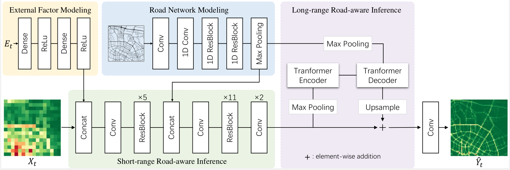

# Road Network Guided Fine-Grained Urban Traffic Flow Inference
<!-- This work focus on how to accurately generate fine-grained data from coarse-grained data collected with a small number of traffic sensors, which is termed fine-grained urban traffic flow inference.
we propose a novel Road-Aware Traffic Flow Magnifier (RATFM), which fully exploits the prior knowledge of road network to learn the distribution patterns of fine-grained traffic flow. -->
Accurate inference of fine-grained traffic flow from coarse-grained one is an emerging yet crucial problem, which can help greatly reduce the number of traffic monitoring sensors for cost savings. In this work, we notice that traffic flow has a high correlation with road network, which was either completely ignored or simply treated as an external factor in previous works. To facilitate this problem, we propose a novel Road-Aware Traffic Flow Magnifier (RATFM) that explicitly exploits the prior knowledge of road networks to fully learn the road-aware spatial distribution of fine-grained traffic flow. Benefiting from the tailor-designed road-aware inference mechanism, our method can generate high-quality fine-grained traffic flow maps. Extensive experiments on three real-world datasets show that the proposed RATFM outperforms state-of-the-art models under various scenarios.
. 

If you use our code and datasets for your research, please cite [our paper](https://arxiv.org/abs/2109.14251) :

```
@article{liu2021road,
  title={Road network guided fine-grained urban traffic flow inference},
  author={Liu, Lingbo and Liu, Mengmeng and Li, Guanbin and Wu, Ziyi and Lin, Liang},
  journal={arXiv preprint arXiv:2109.14251},
  year={2021}
}
```


## Framework
<!--  -->



## Requirements
Our RATFM uses the following dependencies: 

* [Pytorch 1.5+](https://pytorch.org/get-started/locally/)
* [Torchvision 0.6+](https://pytorch.org/get-started/locally/)
* [CUDA](https://developer.nvidia.com/cuda-downloads) 9.2 or latest version
* [Python 3.8+](https://www.python.org/downloads/)
* [Opencv-python 4.5.1](https://pypi.org/project/opencv-python/)
* [Pillow 8.1.0](https://pypi.org/project/Pillow/)

## Usage

###  1.Clone the repository
```
git clone git@github.com:luimoli/RATFM.git
cd RATFM/
```

### 2.Dataset Preparation
The datasets ***XiAn*** and ***ChengDu*** we construt is detailed in Section 4.1.1 of our paper. Here we release them for public use. 

Notice that the traffic maps in our datasets have two channels (i.e., inflow and outflow).  More specifically, ***we use positive numbers for inflow maps and negative numbers for outflow maps***.

Unzip "./data/<dataset_name>.zip" to obtain the corresponding datasets. 

<!-- For example, the path of training input need to be "./data/P1/train/X.npy". -->
```
# Example of file construction 
XiAn
<your_root_path>/data/XiAn/train/
                                X.npy/    # coarse-grained traffic flow maps
                                Y.npy/    # fine-grained traffic flow maps
                                ext.npy/  # external factor vectors
<your_root_path>/data/XiAn/valid/
                                X.npy/    
                                Y.npy/    
                                ext.npy/  
<your_root_path>/data/XiAn/test/
                                X.npy/    
                                Y.npy/    
                                ext.npy/  
```

### 3.Train

Here we present examples of trainning commands which should be conducted on the XiAn dataset:

```
python -m RATFM.train --ext_flag --dataset_name XiAn --city_road_map xian --map_width 64 --map_height 64 --channels 2
```
<!-- Train RATFM without *External Factor Modeling Module*:
```
python -m RATFM.train --folder_name <your_custom_folder> --dataset_name XiAn --city_road_map xian --map_width 64 --map_height 64 --channels 2
``` -->
Or use custom settings to train:
```
python -m RATFM.train --n_epochs <int_num> --lr <float_num> --base_channels <int_num> ...
```
<!-- Several important input arguments: -->
- *ext_flag* : whether to use *External Factor Modeling Module*
- *channels* : number of channels for input and output (2 for XiAn and ChengDu, 1 for TaxiBJ-P1)
- *dataset_name* : which dataset to use (XiAn, ChengDu and TaxiBJ-P1)
- *city_road_map* : which city's road network map should be loaded (xian, cdu, bj)
- *map_width* : the width of fine-grained traffic flow map
- *map_height* : the height of fine-grained traffic flow map
<!-- - *folder_name* : set a folder to preserve the trained models, which will be generated under *./model/<folder_name>/* -->
<!-- - ... -->


<!-- to be supplemented... -->

### 4.Test
Those well-trained RATFM models are placed under *./model/<model_folder_name>/* by default.

Use the following commands to test the pre-trained models:

XiAn
```
python -m RATFM.test --ext_flag --dataset_name XiAn --city_road_map xian --map_width 64  --map_height 64 --channels 2 --batch_size 1
```

ChengDu
```
python -m RATFM.test --ext_flag --dataset_name ChengDu --city_road_map cdu --map_width 64  --map_height 64 --channels 2 --batch_size 1
```

TaxiBJ-P1
```
python -m RATFM.test --ext_flag --dataset_name TaxiBJ-P1 --city_road_map bj --map_width 128  --map_height 128 --channels 1 --batch_size 1
```

Or use custom settings to evaluate your own trained model:
```
python -m RATFM.test --run_num <int_num> ....
```


## License
to be supplemented...

