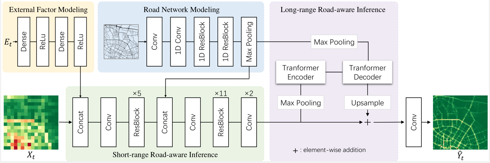
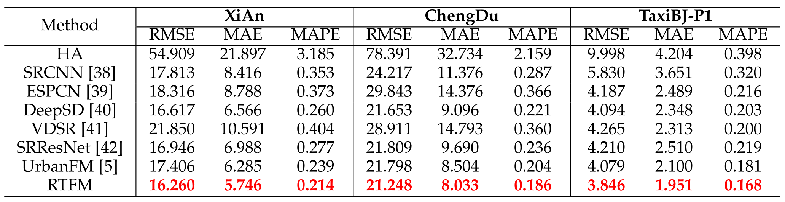

# Road Network Guided Fine-Grained Urban Traffic Flow Inference
This work focus on how to accurately generate fine-grained data from coarse-grained data collected with a small number of traffic sensors, which is termed as fine-grained urban traffic flow inference.
## Framework
<!--  -->


## Results
We evaluate our RTFM on three large benchmarks(XiAn, ChengDu, and TaxiBJ-P1) under several typical scenarios(see chapter 4 in our paper).
Here we present the performance of different methods on the whole testing sets.




## Requirements
Our RTFM uses the following dependencies: 

* Pytorch 1.5+
* Torchvision 0.6+
* CUDA 9.2 or latest version

## Data preparation
The datasets *XiAn* and *ChengDu* we construt is detailed in Section 4.1.1 of our paper. Here we release them for public use. 

unzip "./data/<dataset_name>.zip" to a folder named <dataset_name> to obtain the corresponding datasets. 

For example, the path of training input need to be "./data/P1/train/X.npy".
```
<your_root_path>/data/XiAn/train/
                    X.npy/    # coarse-grained traffic flow maps
                    Y.npy/    # fine-grained traffic flow maps
                    ext.npy/  # external factor vectors
```


## Model Test
We here provide pre-trained models in our paper.

Use the following commands to test the well-trained models:

XiAn
```
python -m RTFM.test --run_num 0 --ext_flag --folder_name xian --dataset_name XiAn --city xian --img_width 64  --img_height 64 --channels 2
```

ChengDu
```
python -m RTFM.test --run_num 0 --ext_flag --folder_name cdu --dataset_name ChengDu --city cdu --img_width 64  --img_height 64 --channels 2
```

TaxiBJ-P1
```
python -m RTFM.test --run_num 0 --ext_flag --folder_name P1 --dataset_name P1 --city P1 --img_width 128  --img_height 128 --channels 1
```


## Model Training

```
python -m RTFM.train --ext_flag --folder_name xian_train_example --dataset_name XiAn --city xian --img_width 64  --img_height 64 --channels 2
```

to be supplemented...

<!-- Examples of input arguments:
- channels: input and output channel (2 for XiAn and ChengDu)
- ext_flag: whether to use external factor fusion subnet
- dataset: which dataset to use

The following examples are conducted on dataset XiAn:
* Example 1 (default settings):
```
python -m RTFM.train --ext_flag --dataset "XiAn"
```

* Example 2 (using arbitrary settings):
```
python -m RTFM.train --ext_flag --n_epochs 200 --n_residuals 20 --base_channels 128 --dataset "XiAn"
```

* Example 3 (UrbanFM-ne, i.e., UrbanFM without external subnet):
```
python -m UrbanFM.train --dataset "P1"
``` -->

<!-- * Example 4 (UrbanFM with large amounts of parameters):
```
python -m UrbanFM.train --ext_flag --n_residuals 16 --base_channels 128 --dataset "P1"
``` -->


## Visualization
to be supplemented...


## License
to be supplemented...

