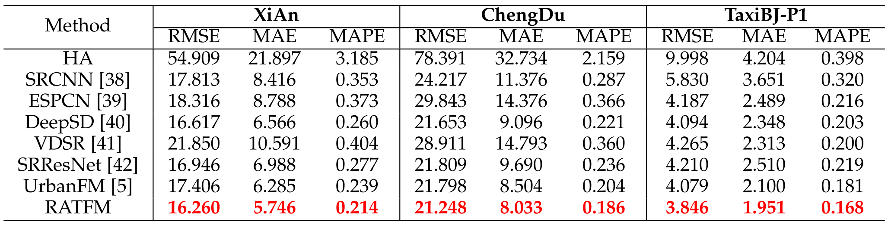

# Road Network Guided Fine-Grained Urban Traffic Flow Inference
This work focus on how to accurately generate fine-grained data from coarse-grained data collected with a small number of traffic sensors, which is termed as fine-grained urban traffic flow inference.
## Framework
<!--  -->


## Results
We evaluate our RATFM on three large benchmarks ( XiAn, ChengDu, and TaxiBJ-P1 ) under several typical scenarios(see chapter 4 in our paper).
Here we present the performance of different methods on the whole testing sets.




## Requirements
Our RATFM uses the following dependencies: 

* Pytorch 1.5+
* Torchvision 0.6+
* CUDA 9.2 or latest version
* python 3.8+
* opencv-python 4.5.1
* pillow 8.1.0

## Dataset Preparation
The datasets ***XiAn*** and ***ChengDu*** we construt is detailed in Section 4.1.1 of our paper. Here we release them for public use. 

unzip "./data/<dataset_name>.zip" to a folder named <dataset_name> to obtain the corresponding datasets. 

For example, the path of training input need to be "./data/P1/train/X.npy".
```
<your_root_path>/data/XiAn/train/
                                X.npy/    # coarse-grained traffic flow maps
                                Y.npy/    # fine-grained traffic flow maps
                                ext.npy/  # external factor vectors
```

## Train

Several important input arguments:

- *channels* : input and output channel (2 for XiAn and ChengDu)
- *ext_flag* : whether to use *External Factor Modeling Module*
- *folder_name* : set a folder to preserve the trained models, which will be generated under *./model/<folder_name>/*
- *dataset_name* : which dataset to use (XiAn, ChengDu and TaxiBJ-P1)
- *city* : which city's road network map should be loaded (xian, cdu, P1)
- *img_width* : the width of fine-grained traffic flow map
- *img_height* : the height of fine-grained traffic flow map
- ...

Here we present examples of trainning commands which should be conducted on the XiAn dataset:

Train full RATFM:
```
python -m RATFM.train --ext_flag --folder_name <your_custom_folder> --dataset_name XiAn --city xian --img_width 64 --img_height 64 --channels 2
```
Train RATFM without *External Factor Modeling Module*:
```
python -m RATFM.train --folder_name <your_custom_folder> --dataset_name XiAn --city xian --img_width 64 --img_height 64 --channels 2
```
Or use custom settings to train:
```
python -m RATFM.train --n_epochs <int_num> --lr <float_num> --base_channels <int_num> ...
```


<!-- to be supplemented... -->

## Test
We here provide well-trained RATFM models in our paper, which are placed under *./model/<folder_name>/<model_folder_name>/*.

Use the following commands to test the pre-trained models:

XiAn
```
python -m RATFM.test --ext_flag --folder_name xian --dataset_name XiAn --city xian --img_width 64  --img_height 64 --channels 2
```

ChengDu
```
python -m RATFM.test --ext_flag --folder_name cdu --dataset_name ChengDu --city cdu --img_width 64  --img_height 64 --channels 2
```

TaxiBJ-P1
```
python -m RATFM.test --ext_flag --folder_name P1 --dataset_name TaxiBJ-P1 --city P1 --img_width 128  --img_height 128 --channels 1
```

Or use custom settings to evaluate your own trained model:
```
python -m RATFM.test --run_num ....
```


<!-- 
The following examples are conducted on dataset XiAn:
* Example 1 (default settings):
```
python -m RATFM.train --ext_flag --dataset "XiAn"
```

* Example 2 (using arbitrary settings):
```
python -m RATFM.train --ext_flag --n_epochs 200 --n_residuals 20 --base_channels 128 --dataset "XiAn"
```

* Example 3 (UrbanFM-ne, i.e., UrbanFM without external subnet):
```
python -m UrbanFM.train --dataset "P1"
``` -->

<!-- * Example 4 (UrbanFM with large amounts of parameters):
```
python -m UrbanFM.train --ext_flag --n_residuals 16 --base_channels 128 --dataset "P1"
``` -->


## Visualization
to be supplemented...


## License
to be supplemented...

